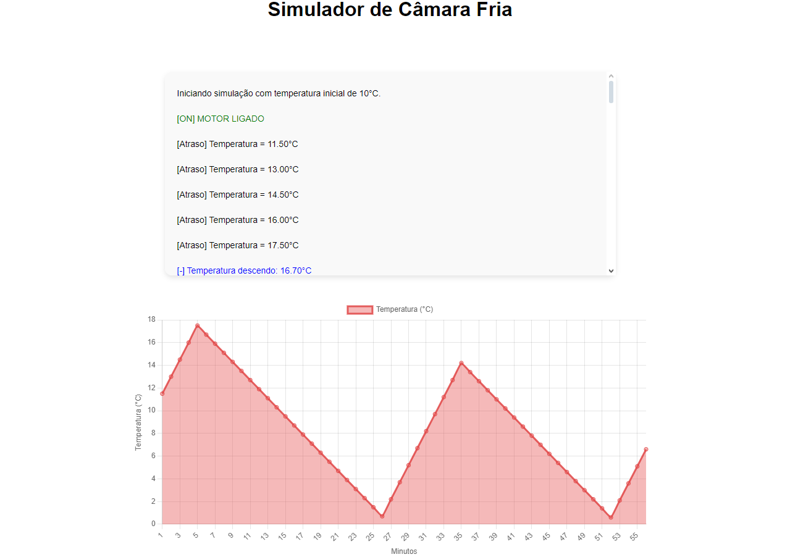

# Simulador de Temperatura em Tempo Real

Este projeto em desenvolvimento irá simular o controle de temperatura de uma câmara fria, exibindo os dados de temperatura em tempo real em um gráfico interativo. A temperatura é atualizada a cada segundo, com valores simulados para fins de demonstração.

## Tecnologias Utilizadas

- **TypeScript**: Para garantir um código tipado e mais seguro e dar vida a interface.
- **Vite**: Ferramenta de build moderna para facilitar o desenvolvimento com TypeScript.
- **HMTL E CSS**: Para criação da interface estática.
- **Chart.js**: Biblioteca para criar gráficos interativos.
- **chartjs-plugin-streaming**(avaliando sobre): Plugin do Chart.js para permitir a atualização dinâmica de gráficos.

## Ver o funcionamento(trabalhando ainda)
Acessando este link: (firebase link here) você conseguirá ver o projeto rodando 

## Como Rodar o Projeto

### 1. Clonar o repositório

```bash
git clone <URL do repositório>
cd <diretório do projeto>
```

### 2. Instalar as dependências

Instale as dependências utilizando o comando:

```bash
npm install
```

### 3. Iniciar o servidor de desenvolvimento

Após instalar as dependências, execute o comando abaixo para rodar o servidor:

```bash
npm run dev
```

O projeto estará disponível em **http://localhost:5173** (ou o endereço fornecido no terminal).

### 4. Descrição


Ao acessar o endereço acima, você verá a aplicação, assim como na imagem abaixo:



Nesta serão exibido um gráfico de linhas, demonstrando a temperatura ao longo do tempo, assim como um container de logs, onde será repassado passso a passo (minuto a minuto) a simulação da camara fria com a exibição de informações como:

- Estado do motor: Ligado, Desligado
- Variação de Temperatura, assinalada com `[ATRASO]` para demonstrar o delay no efeito do motor, assim como assinalada de `[-]` para demonstrar a queda de temperatura e `[+]` para aumento desta.
- Estado do sensor: Função que verifica e calcula o ponto ideial para desligar ou ligar o motor, considerando o tempo de atraso no efeito, assim o limite inferior e superior nunca serão excedidos. Sinalizada por meio de `[SENSOR]` 
- Tempo total da simulação em minutos.

## Estrutura do Projeto

- **`src/`**: Contém os arquivos principais do código-fonte.
  - **`assets/`**: Contém os arquivos de estilização CSS.
  - **`core/`**: Contém as classes de lógica de controle de temperatura.
  - **`view/`**: Responsável pela interface gráfica.
    - **`chart.ts`**: Arquivo responsável pelo gráfico usando a lib Chart.js
    - **`ui.ts`**: Arquivo responsável pelo container com os logs da simulação
  - **`main.ts`**: Arquivo principal para inicializar o aplicativo.
- **`index.html`**: Arquivo HTML com o container para o app e alguns elementos.


